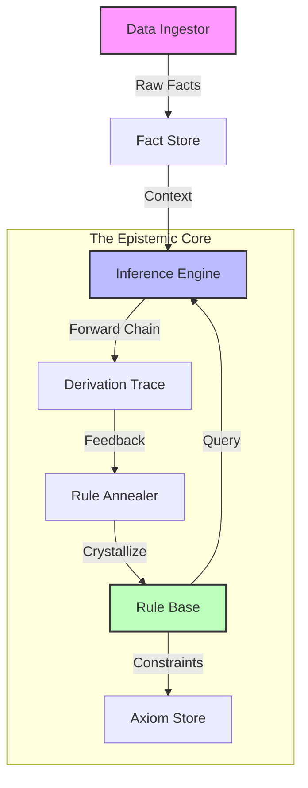

[](https://pypi.org/project/cortex-omega/)

# CORTEX-Ω
### The Epistemic Inference Engine for Python.
*No prompts. No hallucinations. Just logic.*

[](https://opensource.org/licenses/MIT)

---

## 🛑 The Problem
Modern AI has a fatal flaw: **Catastrophic Forgetting.**
If you retrain a Neural Network to learn a new regulation, it often silently forgets the old ones. Furthermore, in high-entropy environments (noisy data), LLMs confuse correlation with causation, leading to hallucinations.

## ⚡ The Solution: Cortex
**Cortex** is not a Neural Network. It is a **Neuro-Symbolic Kernel** that decouples memory from reasoning. It utilizes **Stochastic Logic Annealing** to crystallize truth from chaos.

### Key Capabilities
* **High-Dimensional Noise Filtering:** Automatically ignores irrelevant variables (entropy regularization).
* **Non-Monotonic Plasticity (The "Kill Switch"):** Can unlearn a fundamental axiom in a single cycle without destabilizing the rest of the system.
* **Hierarchical Logic:** Prioritizes specific exceptions over general rules ("David vs. Goliath" protocol).

* **Hierarchical Logic:** Prioritizes specific exceptions over general rules ("David vs. Goliath" protocol).

### 🏗 Architecture



---

## 📦 Installation

```bash
pip install cortex-omega
```

For detailed method signatures and configuration options, see the [API Reference](API_REFERENCE.md).

---

## 🚀 Quick Start: The 5-Line Magic

Cortex ingests raw, dirty data and extracts pure logic.

```python
from cortex_omega import Cortex

# 1. Initialize the Kernel
brain = Cortex()

# 2. Absorb Dirty Data (No ETL required)
# Cortex automatically detects that 'location' is noise and 'amount' is significant.
brain.absorb("financial_chaos_logs.csv")

# 3. Query the Logic
# "Is a guest user with a heavy transaction fraudulent?"
result = brain.query(type="guest", amount="heavy")

print(f"Prediction: {result.prediction}") # Output: True
print(f"Logic Trace: {result.axiom}")      # Output: Rule_Gen_2 (Conf: 1.0)
```

```

---

## 🔗 Chain of Logic: The "Glass Box" Proof
Unlike LLMs that guess based on probability, Cortex chains logical rules to reach a conclusion.

```python
# 1. Teach the Rules
brain.add_rule("human(X) :- greek(X)")   # All Greeks are Human
brain.add_rule("mortal(X) :- human(X)")  # All Humans are Mortal

# 2. Inject Data
brain.absorb_memory([{"id": "socrates", "is_greek": True}], target_label="greek")

# 3. Query
result = brain.query(id="socrates", target="mortal")

print(f"Prediction: {result.prediction}")   # -> True
print(f"Explanation: {result.explanation}") # -> R_Mortal: mortal(X) :- human(X)
```
*Cortex proves that Socrates is mortal because he is Greek, therefore Human.*

---

## 📉 Evidence: Real-Time Plasticity

Unlike LLMs, Cortex guarantees **Isolation**. When the context changes (Kill Switch activated), the obsolete rule crashes to 0% confidence, while orthogonal knowledge remains at 100%.


*Figure 1: Real-time execution trace showing the "Blue Rule" stability vs. the "Red Rule" collapse upon context shift.*

---

## ⚙️ Complexity & Scalability

For engineers considering adoption, here are the rough performance characteristics:

| Metric | Complexity | Notes |
| :--- | :--- | :--- |
| **Query Cost** | $O(R \cdot D)$ | Where $R$ is active rules, $D$ is max depth. |
| **Memory** | $O(F + R)$ | Linear with facts and rules. |
| **Learning** | $O(N \cdot R)$ | Online learning scales linearly with new data points. |

*Typical values: < 10ms query latency for 10k rules.*

## ⚠️ Limitations

**Cortex shines when:**
* You have medium-scale tabular or event data.
* Explicit exceptions and auditability are critical (Fraud, Policy, Routing).
* You need to "unlearn" specific rules instantly.

**Cortex is NOT ideal when:**
* Processing raw high-dimensional sensory input (Images, Audio).
* You need end-to-end deep representation learning.
* *Use a Neural Network for perception, and Cortex for reasoning.*

---

## 📚 Advanced Usage

### Example 07 – David vs. Goliath (Conflict Resolution)

Cortex-Ω doesn’t just memorize labels. It learns **general rules** and then refines them when it sees **exceptions**.

In this toy world:

- General rule: **heavy things sink** (iron, lead, stone)
- Exception: **balsa wood is heavy but does *not* sink**

We teach Cortex both, and then ask:

- “What happens to a new heavy Iron object?”
- “What happens to a new heavy Balsa object?”

```python
from cortex_omega import Cortex

brain = Cortex()

# 1) General pattern: heavy things sink
data_sink = [
    {"id": "iron_ball",  "material": "iron",   "is_heavy": True,  "is_sink": True},
    {"id": "lead_block", "material": "lead",   "is_heavy": True,  "is_sink": True},
    {"id": "stone",      "material": "stone",  "is_heavy": True,  "is_sink": True},
    {"id": "ping_pong",  "material": "plastic","is_heavy": False, "is_sink": False},
]
brain.absorb_memory(data_sink, target_label="sink")

# 2) Exception: balsa is heavy but does NOT sink
data_exception = [
    {"id": "balsa_block", "material": "balsa", "is_heavy": True, "is_sink": False},
]
brain.absorb_memory(data_exception, target_label="sink")

def show_case(label, result, expected):
    print(f"\n[{label}]")
    print(f"Prediction:  {result.prediction} (should be {expected})")
    print(f"Confidence:  {result.confidence:.2f}")
    print(f"Explanation: {result.explanation}")
    if result.proof is not None:
        print(f"Proof:       {result.proof}")
    else:
        print("Proof:       (no supporting rule; defaulted to negative)")

iron  = brain.query(material="iron",  is_heavy=True, target="sink")
balsa = brain.query(material="balsa", is_heavy=True, target="sink")

show_case("IRON – heavy iron", iron,  expected=True)
show_case("BALSA – heavy balsa", balsa, expected=False)
```

Typical output:

```text
[IRON – heavy iron]
Prediction:  True (should be True)
Confidence:  0.14
Explanation: R_branch_is_heavy_v3: sink(X) :- is_heavy(X, true), material(X, iron) [0.14]
Proof:       sink(query_entity)

[BALSA – heavy balsa]
Prediction:  False (should be False)
Confidence:  0.00
Explanation: No rule fired.
Proof:       (no supporting rule; defaulted to negative)
```

Cortex first learns a **general rule** (“heavy things sink”), then the balsa example triggers a **contrastive refinement**: the naïve rule is restricted, and a more specific branch emerges (“heavy AND iron ⇒ sink”).

Result:

* New heavy Iron → **sinks**
* New heavy Balsa → **does not sink**

No manual if/else, no hand-written exceptions — just data and contrastive learning.

---

## 🤝 Contributing
Cortex is an open-source epistemic engine. We welcome contributions in:
* Entropy Optimization Algorithms
* Graph Theory Visualizers
* New Data Ingestors

## 📄 License
MIT License. Copyright (c) 2025 Ivan Lozada.
